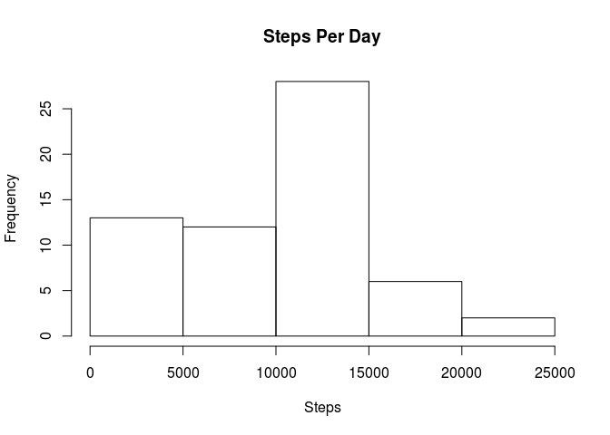
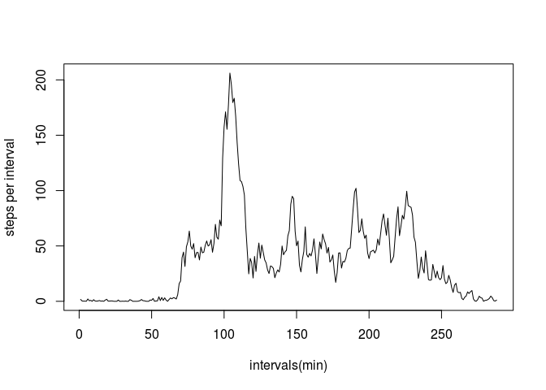
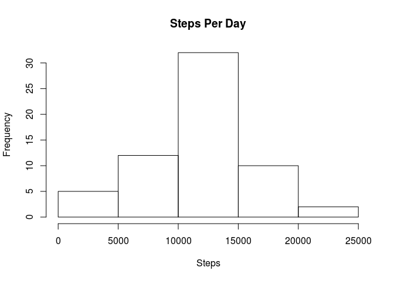
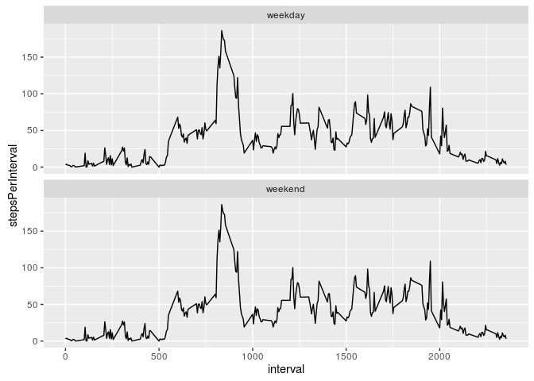

# Reproducible Research: Peer Assessment 1


## Downloading and reading in the data set. No preprocessing required.


```r
unzip('activity.zip')
activity <- read.csv('activity.csv')
```

## What is the mean total number of steps taken per day?

First, calculate the total number of steps taken per day

```r
spl <- split(activity, as.factor(activity$date))
summationFunction <- function (actPerDay) {
  sum(actPerDay$steps, na.rm = TRUE)
}
stepsPerDay <- sapply(spl, summationFunction)
```

Plot a histogram of the total number of steps taken per day

```r
hist(stepsPerDay, main = "Steps Per Day", xlab = "Steps")
```



Mean and Median of the total number of steps taken per day

```r
summary(sapply(spl, summationFunction))
```

```
##    Min. 1st Qu.  Median    Mean 3rd Qu.    Max. 
##       0    6778   10400    9354   12810   21190
```

Mean is *9354* steps while the median is *10400* steps.

## What is the average daily activity pattern?

Calculating the average steps taken per interval.

```r
spl <- split(activity, as.factor(activity$interval))

averageFunction <- function (actPerInterval) {
  mean(actPerInterval$steps, na.rm = TRUE)
}

averageStepsPerInterval <- sapply(spl, averageFunction)
```

Plotting the average number of steps taken per inerval against the 5-minute intervals

```r
plot(averageStepsPerInterval, type='l', xlab = 'intervals(min)', ylab = 'steps per interval')
```



*Which 5-minute interval, on average across all the days in the dataset, contains the maximum number of steps?*

sorting the average steps per interval in descending order and taking the largest value.

```r
tail(sort(averageStepsPerInterval),1)
```

```
##      835 
## 206.1698
```
 This indicates the interval labelled **835** (835-840 minutes) is the largest
 
## Imputing missing values

Total number of missing values in the data set. Only the steps variable has missing values

```r
sum(is.na(activity$steps))
```

```
## [1] 2304
```
Theare are a large number of missing values in the data set (2304).

Filling in missing values by using mice package in R.

The mice package in R will help me impute missing values with plausible data values. These plausible values are drawn from a distribution specifically designed for each missing datapoint.

```r
library(mice)
```

```
## Loading required package: Rcpp
```

```
## mice 2.25 2015-11-09
```

The mice() function takes care of the imputing process.

method="pmm" refers to the imputation method. I am using the predictive mean matching as imputation method.
It is especially useful for imputing quantitative variables that are not normally distributed (in our case, positive skew) because it assures the imputed values keep the distribution skewed as well.

```r
tempActivity <- mice(activity, method = 'pmm', m = 1, seed = 50)
```

The complete() function creates the imputed data set from the "mids" object produced by executing the mice() function. This is the new data set with the missing data filled in.

```r
completedActivity <- complete(tempActivity)
```

Calculate the total number of steps taken per day using our filled in data

```r
spl <- split(completedActivity, as.factor(completedActivity$date))
summationFunction <- function (actPerDay) {
  sum(actPerDay$steps, na.rm = TRUE)
}
newStepsPerDay <- sapply(spl, summationFunction)
```

Histogram of the number of steps taken per day using our filled in data

```r
  hist(newStepsPerDay, main = "Steps Per Day", xlab = "Steps")
```



Mean and Median of the total number of steps taken per day

```r
summary(sapply(spl, summationFunction))
```

```
##    Min. 1st Qu.  Median    Mean 3rd Qu.    Max. 
##      41    9819   11460   11420   14480   21190
```

Mean is **11420** while the median is now **11460**. The Mean and Median have clearly increased once we imputed the missing data. They have also come closer together indicating a less skewed distribution. For those days that contained missing values, the total daily number of steps has also clearly increased.


## Are there differences in activity patterns between weekdays and weekends?

Creating a new factor variable in the dataset with two levels - "weekday" and "weekend"

```r
Days <- weekdays(as.Date(completedActivity$date))
dayType <- as.factor(ifelse(Days %in% c('Saturday', 'Sunday'), "weekend", "weekday"))
completedActivity$day <- dayType
```

Calculating the average steps per interval and appending it to the dataframe under the *stepsPerInterval* variable. This will make it easy to make a multi-panel plot.

```r
spl <- split(completedActivity, as.factor(completedActivity$interval))

averageFunction <- function (actPerInterval) {
  mean(actPerInterval$steps, na.rm = TRUE)
}

averageStepsPerInterval <- sapply(spl, averageFunction)
completedActivity$stepsPerInterval <- averageStepsPerInterval
```

We will use the ggplot2 library for creating the plot

```r
library(ggplot2)
ggplot(completedActivity, aes(interval, stepsPerInterval)) + geom_line() + facet_wrap(~day,nrow = 2)
```



The patterns are almost identical indicating it might be vacation, he/she might be unemployed, the individual might be his own boss (enterpreneur), etc. One thing he doesn't have is a 9-5 job or school otherwise the movement patterns would have been quite distinct for the weekdays and weekends.
